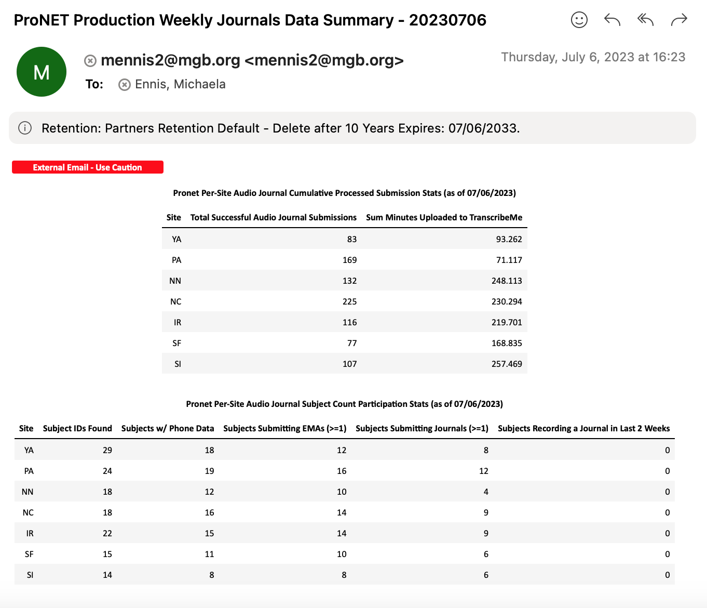
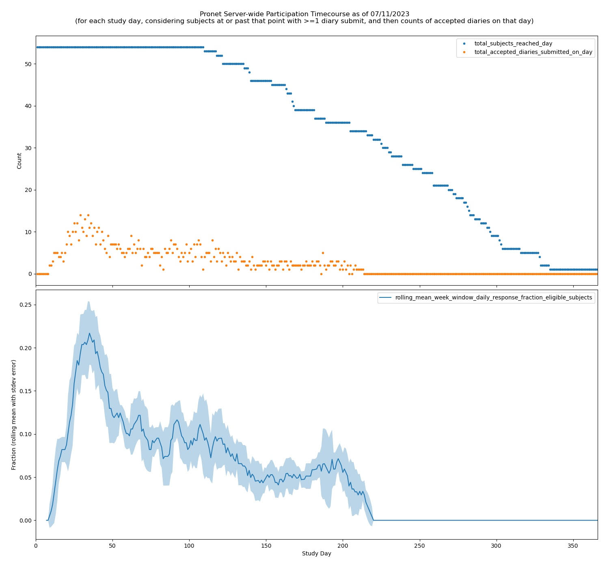
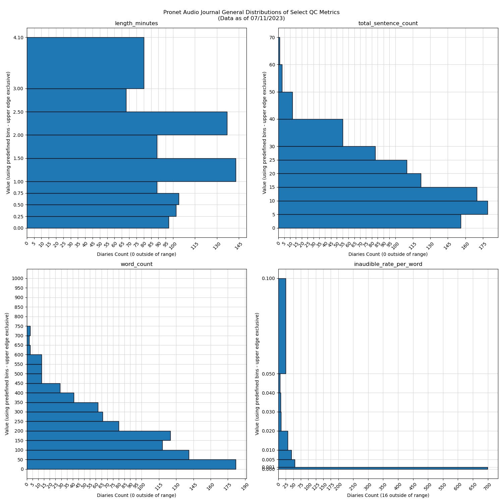
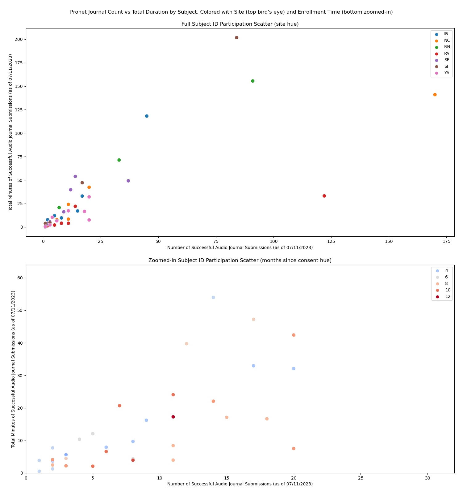

# App-Based Daily Audio Journal Processing Pipeline: Dataflow and QC Management

Code for data organization, participation monitoring, and quality control of daily app-based audio journal recordings for psychiatric research. This pipeline is currently being used by [the AMPSCZ project](https://www.ampscz.org/) -- a large, collaborative, multimodal data collection initiative spearheaded by the NIMH. The audio journal format provides great opportunity for data science research directions that are not well suited for other more traditional speech sampling sources, and it also enables interesting patient-driven self reporting that cannot be obtained with other more common digital phenotyping approaches. Note that I will use "journal" and "diary" interchangeably throughout.

Substantial additional information on both the AMPSCZ project and the audio joural datatype can be found within [my thesis](https://menace.live/thesis). However, the present pipeline was written because of those arguments, to prevent neglect of audio diaries in the future. Therefore all documentation specifically about this pipeline and its early utility within AMPSCZ are restricted to the README here. This README provides setup and use information for future projects that might wish to utilize a version of this code, as well as implementation details and data monitoring tips to assist not only in potential adaptation of the pipeline but also its continued use in AMPSCZ. The documentation is up to date as of early July 2023, at which time responsibility for the code is being gradually passed on to others involved in the project. 

- Michaela Ennis

### Table of Contents

1. [Setup](#setup)
2. [Use](#use)
	- [Configuration Files](#config)
	- [Input Data Requirements](#inputs)
	- [Key Outputs](#outputs)
	- [Runtime and Storage Considerations](#server)
3. [Implementation](#implement)
	- [Site-level Processing Steps](#pipeline)
	- [Server-wide Summary Steps](#summary)
4. [Guide to Monitoring Tools](#monitor)
	- [Weekly Summary HTML Email Contents](#html)
	- [Weekly Detailed Logging Email CSVs and PDFs](#csv)
5. [Next Directions](#future)

### Setup 

It is highly recommended that this code is run on a Linux machine, but there are minimal hardware requirements as the pipeline was designed with low compute resources in mind. Given the somewhat large file sizes of recorded audio however, a decent amount of system storage space is expected (to be detailed). 

The code requires FFmpeg (tested version 4.0.2) and Python3 (tested version 3.9.6) to be installed, as well as use of standard bash commands, including realpath and dirname. For the email alerting to work, the mailx and sendmail commands must be configured. The python package dependencies can be found in the setup/audio_process.yml file, with the exception of SoundFile and librosa. If Anaconda3 is installed this YML file can be used directly to generate a usable python environment.

	
For the AMPSCZ project, the above dependencies were already installed and the mail commands configured on the relevant servers by IT. Thus I installed my code with the following steps (once in the directory location intended for software installs):

 

* git clone https://github.com/dptools/daily_journal_dataflow_qc.git
* cd daily_journal_dataflow_qc/setup
* conda env create -f audio_process.yml
* conda activate audio_process
* pip install soundfile
* pip install librosa
* sudo yum -y install libsndfile
	- This last step was done on Prescient data aggregation server only, to get SoundFile and librosa to work there. It may or may not be necessary to do this then, depending on what libraries are already installed by IT on your machine. 
	- If it is missing, it might require contacting IT to do the libsndfile installation, if you do not have sudo access (which ideally the account officially running daily AV processing should not, to protect raw file integrity).

Note that the setup of the python audio_process environment is a subset of what is already described in the setup instructions for the [process_offsite_audio repository](https://github.com/dptools/process_offsite_audio), which handles dataflow and quality control for recordings of participant interviews collected by AMPSCZ. If that repository is already fully installed and running, as was the case here, there is no need to do any of these installation steps besides cloning the repository (though I did confirm the availability of pytz and seaborn in the conda env and the usability of sendmail, as those are dependencies here but were never directly used in the interview code). One can proceed to the next section with instructions on use of the code instead. 

	
If installing from scratch in a separate context, there will be other possible setup steps required after the above steps though, particularly for various integrations. For example, we used the same TranscribeMe SFTP account for diaries as we did for interviews on each server, but if a separate project instead it would have been necessary to pursue TranscribeMe setup again. Details on these possible extra steps for a blank projects are as follows:

 

In addition to the direct dependencies, there are also indirect dependencies on assumptions about MindLAMP app recording and download settings, and for AMPSCZ there are interactions with other tools written for the purposes of digital psychiatry study management as well -- mainly the Lochness and DPDash codebases, which were further adapted specifically for the use of the AMPSCZ project. Lochness is used for pulling the data submitted by sites and enforcing the expected folder structure, but it would be possible to recreate the folder structure manually or with different software if desired. DPDash is used for visually monitoring updates to the dataset via a regularly refreshing web portal, but is not strictly necessary. For information on installing Lochness and/or DPDash, please see [the AMP-SCZ GitHub team](https://github.com/AMP-SCZ). To ensure the MindLAMP audio recording logistics are in-line with our default expectations, please consult with MindLAMP representatives, making reference to the AMPSCZ project and the DPACC software team. If all these steps are followed, the code here will be immediately able to function within the established framework, described further in the upcoming section on pipeline usage.

Finally, besides the code installation, note that for the transcript portion of the pipeline it will be necessary to have a TranscribeMe SFTP account set up with expected transcription settings, including return format of .txt with no headers and UTF-8 encoding. Specifically, AMPSCZ uses the TranscribeMe full verbatim transcription service for its uploaded interviews with sentence-level timestamps, which is a manually done human (professional) service. Produced transcripts are HIPAA-compliant with personally identifying information (PII) marked. We use the "AI learning team" of transcribers to ensure a maximal level of care is taken in transcription accuracy. A TranscribeMe rep can assist in matching AMPSCZ's protocol for future projects, as it will also be necessary to ensure that you have a username and password that would enable upload to a private SFTP server setup by TranscribeMe, rather than using their default web interface for upload. For more details on the exact output conventions expected from TranscribeMe, please refer to [TranscribeMe's (English) style guide](https://www.dropbox.com/s/lo19xzux3n16pbn/TranscribeMeFullVerbatimStyleGuide.pdf?dl=0). One can also search for more details on TranscribeMe within [my thesis PDF](https://menace.live/thesis).

### Use 

Within the ampscz\_diaries\_launch subfolder of the present repository, we can see exactly how the codebase is used on the AMPSCZ servers. The two high level wrapping scripts, pronet\_all\_sites\_cron\_script.sh and prescient\_all\_sites\_cron\_script.sh, are the scripts used to launch the full pipeline on Pronet and Prescient servers respectively, queued via cronjob. Both of these files are split into two major sections demarcated by comments: "SERVER SPECIFIC COMPONENTS" and "MORE GENERAL COMPONENTS". The latter is the same between the two files, and for using the code on a new server with an otherwise identical infrastructure plan one could simply copy the entire script and change only the server specific settings as needed.

	
To better understand the overall structure of the code base, we can first walk through the steps done by "MORE GENERAL COMPONENTS":

 

1. Using the provided absolute paths to both the code installation and the folder containing the configuration files of interest on the current server, the script calls the top level bash script run\_full\_pipeline\_all\_sites.sh to process each site with a config file found within the given settings folder path.
	* run\_full\_pipeline\_all\_sites.sh simply loops through each configuration .sh file found to run the per-site audio processing pipeline branch, the per-site transcript processing pipeline branch, and finally the per-site subject summaries pipeline branch. The bash scripts managing each of these branches can be found in the site\_level\_pipeline\_branches folder within this repository, and those scripts call on a number of python modules found in the site\_level\_pipeline\_branches/subject\_level\_functions subfolder.
	* Logs for each site are saved in a site-specific subfolder within the logs folder created under the installation path of this repository, with one text file saved per pipeline branch and run (the latter is marked by Unix timestamp).
2. Using the provided server monitoring settings, when intended the cronjob script will also run the top level bash script site\_wide\_summary\_generation.sh to create summaries of site by site progress across the entire server and email out additional monitoring information to specific contacts.
	* site\_wide\_summary\_generation.sh uses the python functions found in the server\_level\_summary\_functions folder within this repository, in addition to managing the bash functionalities required for compilation and sending of the monitoring emails.
	* Logs from the summary run are saved in a date-specific subfolder within the logs/TOTAL subfolder created under the installation path of this repository, with a text file saved for each run alongside all of the generated stats and images used in the various emails. 
3. Again using the provided server-specific settings, the group assignment and permissions of all generated code outputs are updated, to ensure access issues will not impact integration with other AMPSCZ code or ultimately the downstream use of these outputs.

Note that further details on the code implementing the components of both steps 1 and steps 2 will be discussed in an upcoming section, and within this section there will shortly be a subsection on setting up the described configuration files. 

	
To actually utilize the described cron scripts in launching the code for a new server, we will now review the settings to be updated within "SERVER SPECIFIC COMPONENTS", as well as the commands run there to activate the needed dependencies before starting the main cronjob:

 

* server_label gives a name to be used within email subject lines and other server-wide summary output annotations.
* repo_path should be the absolute path to the repository installation folder on the server.
* configs_path should be the absolute path to the folder containing the configuration files for each site to be processed by the main pipeline. Setup of configuration files will be discussed shortly.
* permissions_group_name should be the name of the group on the server that you want all code outputs and log files to belong to.
* data_root should be the absolute path to the main data structure, for AMPSCZ expected to be the PHOENIX folder described also in the configs subsection below.
* basic_email should be the comma-separated list of email addresses to receive the server-wide weekly basic HTML summary email, which is detailed within the below monitoring section.
* basic_email_from gives the email address that the basic email will appear to be sent from via the sendmail command.
* detailed_email should be the comma-separated list of email addresses to recieve the more detailed server-wide weekly monitoring attachments email, which is also detailed within the below monitoring section. This list would generally be expected to be a subset of basic_email.
* mailx_attach should be the letter used in the flag for attachments with the version of mailx installed on the current server. For AMPSCZ, we must use -A on Pronet and -a on Prescient, though -a is typically more common. Thus the code will use -A if this is explicitly set to "A", otherwise it will assume -a.
* daily_testing_mode when set to 1 will run the summary step across sites daily and send the resulting emails to a different address list, otherwise the code will operate as normally intended -- i.e. running the site\_wide\_summary\_generation.sh wrapping script only on Mondays, and ensuring the input recipient email addresses match the above mentioned settings.
* testing_email gives the email addresses to receive both the basic and detailed emails instead of the normal lists, only when the code is in daily testing mode. 

Finally, the server-specific components portion runs needed commands to set up dependencies, like the python environment and ffmpeg, that will be needed in order for the code to successfully run on cron (or at all). For Pronet, this involves sourcing the conda.sh file under the server's installation of miniconda3, and then activating the audio_process environment. For Prescient it is very similar, but also involves sourcing the running user's .bash_profile, where it is ensured that the folder containing the ffmpeg executable is part of the PATH variable, among other things. This part was determined somewhat through trial and error, but one could also systematically setup that all dependencies are findable on the server account that will run the cronjob via the provided commands in this section.

##### Configuration Files 

Within the repository subfolders ampscz\_diaries\_launch/pronet\_configs and ampscz\_diaries\_launch/prescient\_configs, we can find all config files currently being used to run the main diary pipeline on each respective AMPSCZ server to date. As described above, there is one configuration file per site, which contains the needed settings information to run all the branches called by run\_full\_pipeline\_all\_sites.sh for that site. In this subsection, I will walk through all the settings found in a configuration file. Implementation details of the main pipeline branches will then be covered in an upcoming section. 

	
Referring to example configs within the aforementioned config folders could provide additional useful context here. The settings that can be specified for the pipeline via site-level config file currently are as follows:

 

* data_root, which is the root path to the main data structure folder. For a given AMPSCZ server this is the same across sites, and within the Baker Lab this would be the same across most studies (but not all, as data from some different collaborations are kept on different briefcases). In our terminology, this would be the path on the server to the PHOENIX folder.
* site, which is the name of the site (e.g. PronetLA) on the server, or if used for single-site projects, the name of an individual study to be processed (e.g. BLS for the Baker Lab). This must match the folder name corresponding to the site (or study).
* auto_send_on, which for AMPSCZ is expected to always be "Y" (or "y"). If "N" (or anything else), then QC will be computed for the audio without sending anything to TranscribeMe. In that case, any audios selected for upload will be left in the corresponding subjects' audio_to_send folders, and issue logging will treat the files as if SFTP upload failed. This means that if the auto_send_on is ever turned to "Y", all backlog approved audios will also be uploaded to TranscribeMe at that time, unless they had been manually cleared out beforehand. 
	* If the need does arise to pause processing for one or more AMPSCZ sites, potentially due to budget constraints (a much harder problem to forecast for diaries than interviews), this variable could be used to accomplish that while maintaining basic tracking. However I would not recommend regularly flipping this setting back and forth to pause and unpause uploads, as it has not been thoroughly tested and could complicate project monitoring.
	* One could of course turn the code off entirely for a given site by removing its config file from the server's pool, or comment out the cronjob to pause the code across sites. Note that this could cause loss of transcripts for already uploaded audios though if it will be done for an extended period and the pausing process is not carefully manually monitored, whereas transcript pull will continue when auto_send_on = "N". 
* transcribeme_username, which should be the username used to login to the TranscribeMe SFTP server where data transfer for the project is intended to take place. For AMPSCZ this is one email for all Pronet sites and one email for all Prescient sites. For a lab group this may always be the same username across studies, or it may vary depending on payment allocation details.
* length_cutoff, which is the minimum duration for an individual diary recording to be sent to TranscribeMe, in seconds. Here we use 1 second to avoid sending garbage recordings.
* db_cutoff, which is the minimum volume for a diary recording to be considered acceptable for transcription. This may vary based on both data collection protocol details and project analysis goals/budgetary allowance. For these diaries we decided on 50 db based on early testing. 
* transcription_language, which is a string (currently in all caps) that specifies the primary language at a given site. The pipeline uses this string in the filename it uploads to TranscribeMe, to assist their process in assigning the correct transcription team to a given upload. When transcripts are pulled back this part of the name is removed, so it is used only in the TranscribeMe upload process and not on actual pipeline outputs (or intermediates). This could theoretically be used to convey other messages to TranscribeMe such as transcription settings, in future adaptation of the code. The information here will also be compiled as part of metadata that goes to the NIH data repository for AMPSCZ.
	* At this time however we are only uploaded English-language audio journals to TranscribeMe, something discussed in more detail in the future directions section at the end of this README. For foreign sites, it is less clear how we can accurately label language by simply assuming the same language will be used in all diaries site-wide, and TranscribeMe requires an accurate language designation to produce our transcripts currently.
* timezone, which is the timezone to assume that all diary submissions from the given site are recorded in. This allows the UTC submission time noted by MindLAMP to be converted to the relevant local time, and study day assignment to be adjusted accordingly when needed. While there are edge cases where this will be incorrect, it is by and large a fine assumption for AMPSCZ's purposes and the sites we are working with. The timezone should be listed in the settings file as a string matching an IANA designation. IANA timezone identifier can be found for any location by looking that location up on [the website time.is](https://time.is).

Note that while these config settings share some similarities with the configs used for the interview dataflow/QC pipeline of AMPSCZ, there are a number of distinctions and the ones used here were setup entirely separately. 

To add new sites to the existing processing for the AMPSCZ project, one can simply add another config in the appropriate folder for that central server, working from the existing configs for that server as a template (and referring to the settings list where additional details are needed). In general, only "site", "transcription_language", and "timezone" might require changes from site to site for an already established server within the scope of AMPSCZ. One would then just need to make sure that there are not issues with folder permissions when Lochness initializes the structure for that site. 

Obviously for setting up a brand new process, one would aim to replicate the current setup for Pronet and Prescient as far as settings files and cronjob go, after following the installation instructions in the preceding section to get the code and its dependencies onto the new central server. In the case of a new central server, it would obviously be necessary to change some further settings within each new config -- such as the TranscribeMe username, which would require creating a separate SFTP account with TranscribeMe reps first, as described in the setup instructions above.

	
On that note, the final component built into the config .sh file is the management of the password for the specified TranscribeMe SFTP account, which I will describe how to set up for new servers/projects here:

 

In order for the code to run automatically on a cronjob, the password for the TranscribeMe SFTP server needs to be stored somewhere on the source server. By default, this is assumed to be in a file named .passwords.sh directly under the repo folder where the code is being run. The .gitignore included with the code will ensure that the .passwords.sh file is never pushed back to the central repository (as well as any logs generated by the code more broadly). On both Pronet and Prescient data aggregation servers, this passwords file has 700 permissions and is owned by the account that is set to run the pipeline code. For more on privacy/security, see the security review section in the [process_offsite_audio repository](https://github.com/dptools/process_offsite_audio), which already established all the needed considerations for working with sensitive audio data as part of AMPSCZ. 

If one will use an identical setup to the AMPSCZ central Lochness servers, then it is straightforward to just create the daily_journal_dataflow_qc/.passwords.sh file directly and then paste in the following two lines:

	transcribeme_password="password"
	export transcribeme_password

Where of course "password" is replaced with the TranscribeMe SFTP account password corresponding to that server's account (i.e. the username within the same config file). Note that TranscribeMe will also periodically require this password to be updated, so for all projects (including both accounts for AMPSCZ) it will be necessary to occasionally update the password contained in the .passwords.sh file directly on the applicable server. In our case, we can simply copy .passwords.sh from process_offsite_audio to daily_journal_dataflow_qc.

If one wants to store the password file elsewhere or needs to use different password files for different studies/sites operating out of the same server (because different TranscribeMe SFTP accounts are being used), the path to the passwords file can be specified using the passwords_path variable found at the bottom of each config file. The passwords file itself needs to be an *sh* file type with content matching the above to work out of the box, but there is no other restriction on the naming/folder placement (as long as the running account can access) when its path is appropriately specified within the corresponding config.sh settings file.

##### Input Data Requirements 

With configuration files set up, the code should be immediately runnable for new sites within the AMPSCZ framework. However if planning to adapt to a different new project, it could be important to understand more deeply the specific input expepctations of the code -- for example, if needing to replicate input folder structure without using Lochness, or wanting to move to a different app for diary collection than MindLAMP. As such, I will provide here the specific input expectations for journals to be processed on a data aggregation server by this code. This subsection will additionally provide useful context for understanding the implementation details of the upcoming section. 

Ultimately, the code expects to work within a PHOENIX data structure matching the conventions described in the AMPSCZ standard operating procedure (SOP). It is worth highlighting that this pipeline expects all inputs to be found as raw datatypes under PHOENIX, and similarly all outputs are saved/modified as processed datatypes only. The conventions specified therefore cover high level folder structure as well as details of raw diary paths. 

	
More specifically, the overall folder structure is expected to meet the following criteria on the central server, for each site to be processed:

 

* There needs to be a folder named with corresponding site ID under both the GENERAL and PROTECTED subfolders of PHOENIX.
* Under the site's GENERAL side folder there must be at least a processed subfolder, and under the PROTECTED site folder there must be both processed and raw subfolders.
* Under each of PHOENIX/PROTECTED/\[site\]/raw, PHOENIX/PROTECTED/\[site\]/processed, and PHOENIX/GENERAL/\[site\]/processed, there should be one subfolder for each enrolled participant -- with name matching the corresponding AMPSCZ subject ID. Under each of those folders, we then expect a "phone" subfolder if the participant indeed does have phone data.
	* Missing subject ID folders will not prevent the code from running for other subjects in an input site, but it can obviously prevent any missing subjects from having possible diaries processed.

	
We then expect raw audio journal data, found under each subject's PROTECTED side raw phone folder, to meet the following conventions:

 

* Both recording MP3s and matching JSON metadata for every submitted diary by that subject will be found loose under the PHOENIX/PROTECTED/\[site\]/raw/\[subject\]/phone/
* The MP3s should be named as U\[mindlampID\]\_\[site\]\_activity\_\[datestamp\]\_sound\_\[n\].mp3, with datestamp defined based on Unix time (i.e. UTC) and number based on the submission number it was for that ID on that (UTC-determined) day, starting with 0.
	* A specific example filename for an MP3 is U6435702683\_PronetYA\_activity\_2023\_04\_13\_sound\_0.mp3
* In that same folder, there must also be a JSON corresponding to each MP3, named as U\[mindlampID\]\_\[site\]\_activity\_\[datestamp\].json
	* Note that if multiple MP3s were uploaded on a single UTC date for that subject, they are expected to be matched to the same JSON.
	* The code does not necessarily expect a specific mindlampID for a given subject, except that it must match between JSON and correpoding MP3(s) available.
* The JSONs here contain info from both EMA responses and audio diary metadata, so it is possible to have JSON files without any matching MP3. However, when actually parsing the data in the JSON, we can find where metadata expects a diary was recorded -- in this case, we absolutely do expect that the specified MP3(s) exist. 
	* To determine if an object within a checked JSON is meant to be diary metadata, we look for a "static_data" field in that item, and a "url" field under the "static_data" field. For valid diaries, the value under the "url" field will specify the sound number as "SOUND\_0", "SOUND\_1", etc. Non-diary records will not have any value in this field, if it exists at all.
	* When there are multiple diaries submitted in one UTC day, there will simply be multiple objects within the JSON that have the sound number specified within the aforementioned field. For each of these, we expect to find an MP3 in the corresponding raw data folder with the same name as the JSON (sans extension), but with \_sound\_\[n\].mp3 appended, according to the sound number given via the JSON.
	* Obviously, for all MP3s found, we expect to find such a record directly in the correponding JSON too. 
	* Additionally, for a valid diary metadata JSON object, we also want to find the precise Unix timestamp of submission directly under "timestamp" field of that item. 

Note that a recent change made by MindLAMP broke some of these JSON expectations, but it also broke the pulling of audio diary MP3s by Lochness entirely, and this change only affected Pronet for some reason, not Prescient. We are working with MindLAMP to revert this change and go back to the described expectations. 

Note in addition to the expectations for naming of incoming raw data, the code also requires a metadata file directly within the site-level folder contained on the GENERAL side, and will only process a particular participant ID if that ID appears as a row in said metadata file with a corresponding valid consent date (per Lochness guidelines, though again this could be replicated independently). If there are issues encountered with the basic study setup appropriate error messages will be logged about violated conventions.

The transcript side of the pipeline on the other hand primarily relies on outputs from the audio side, so once audio processing is successfully running structure should be automatically enforced for these downstream steps. However, it also expects TranscribeMe to return transcripts with a name identical to the uploaded audio filename, just with the extension switched to .txt. So it is possible, though not an issue we've encountered, that TranscribeMe could cause a stall in processing by violating naming conventions. Monitoring of audio pending transcription for an excessive number of days is built into the code in case we do need to catch this. 

##### Key Outputs 

With code installed and folder structure and input expectations in place, we can finally discuss the primary outputs of the pipeline. Thus in this subsection we first introduce and really motivate the pipeline by providing an outline of the most key outputs generated, along with how they might be used downstream and where they can be expected to be found on the server. Details on intermediate outputs and more specifics about final output content (as well as how that content is obtained) will be part of the upcoming implementation section.

For AMPSCZ, Lochness is already setup to push any text file or CSV outputs found anywhere under the phone datatype on the GENERAL side of processed to the *predict* server for downstream processing. This is where files can be staged to be shared with the NIH data repository or imported into tools like DPDash. We therefore have our key shareable outputs all found within corresponding PHOENIX/GENERAL/\[site\]/processed/\[subject\]/phone/audio_journals folders.

	
Those shareable outputs are:

 

* Redacted TranscribeMe transcript text files, each found under a subfolder "transcripts" of the mentioned audio_journals GENERAL processed folder.
	* File names for these transcripts are of the form \[site\]\_\[subject\]\_audioJournal\_day\[####\]\_submission\[#\]\_REDACTED.txt
* CSV-formatted transcripts with simple sentence-level metrics alongside the text and metadata pulled from TranscribeMe for each row. These CSVs can be found under a subfolder "csvs_with_per_sentence_stats" of the aforementioned transcripts folder.
	* File names for the CSVs match those for the corresponding transcript texts, except with txt extension removed and "\_withSentenceStats.csv" appended instead.
	* Provided sentence counting stats are basic metrics related to quanitfying known TranscribeMe notation; the exact columns included will be given when expanding on implementation details below.
* Found directly under each audio_journals shareable output folder for an applicable subject, we also have two DPDash-formatted CSVs giving audio and transcript QC metrics (respectively) for each processed diary for that subject, where available. 
	* The audio QC CSV has name in the form \[TwoDigitSiteID\]-\[subject\]-diaryAudioQC-day\[StartingStudyDay\]to\[LastStudyDay\].csv, where TwoDigitSiteID is the last two characters of the site name (i.e. with no server identifier included) and StartingStudyDay and LastStudyDay are the first day number with a diary available (that has audio QC features) and the most recent day number with a diary available (again that has audio QC features).
	* The transcript QC CSV is named analogously for the diary-level transcript features available, \[TwoDigitSiteID\]-\[subject\]-diaryTranscriptQC-day\[StartingStudyDay\]to\[LastStudyDay\].csv
	* For more info on these conventions, see the DPDash documentation. Columns contained in each DPDash QC CSV here will be described within the implementation section below. 

In addition to the outputs planned for wider sharing, there are also many file accounting and QC summary outputs that will be used to facilitate monitoring by select study staff. Those are compiled on the data aggregation server but are not kept on the GENERAL side. They are instead communicated to those relevant monitoring personnel via an email alerting system, and where relevant are built on by subsequent runs of the pipeline. 

The monitoring emails and the data included in them/attached to them will be covered in depth in a later section. For anyone planning to monitor outputs of the code but not necessarily make changes to the pipeline's implementation, skipping all the way to said section on monitoring tools below is recommended.

##### Runtime and Storage Considerations 

As a final brief subsection for code users before moving on to implementation details, I will summarize observations about runtime and storage requirements of this code base. It is apparent from this that in the grand scheme of things, audio journal storage pales in comparison to many other collected datatypes, and so any group already running analyses for interview recordings, raw accelerometry and GPS data, or fMRIs should have no issue with compute or storage resources at all in expanding to cover diaries too. 

	
Click here for pilot notes on runtime requirements:

 

The JSON/MP3 file accounting step and even new audio file WAV conversion take a negligible amount of time. By far the largest driver of runtime on the audio side of the pipeline is the upload to TranscribeMe, with a much smaller contribution by the audio QC computation (about one sixth of the time contributed by the SFTP process). In all, it took ~17 minutes for the audio pipeline branch to finish processing when newly launched on the Prescient site ME. This included the upload of 135 audio journals totalling 211.52 minutes from across 25 site ME subjects (with 69 checked for having any app-based active reporting data). With the pipeline regularly running, even once many more sites are actively collecting data, we would expect less data than this to come through on a given single day, so we should have minimal problem with runtime on Prescient. 

The transcript side is expected to take notably less time than the audio for the same number/size of transcripts once they are returned, and to just check availability of all pending transcripts upon launch for site ME it took less than 1 minute. All per subject summary operations also took less than 1 minute, and analogously for the server-wide summaries in these same conditions. We would never expect the summary operation to take significant time relative to the audio processing, so our focus would really be on audio.

For the Pronet aggregation server, resources are a bit more limited and we might expect code to run a little slower as a result. However the runtime is not too far off from what Prescient projects might suggest -- in just under 2 hours the code was able to process and upload a great deal of backlog audio from across 6 different sites, including 826 files and ~1287 total minutes of audio from 46 unique subjects. A safe guesstimate for the pipeline to run in its entirety then is to expect about 1 minute of processing time per 10 minutes of real newly uploaded audio, with a few additional minutes of overhead. This is very sustainable on both servers and would be unlikely to be an issue for other projects potentially adapting the code either. Note though that the strength of internet connection that the server has may influence these results more profoundly than any other variables.

	
Click here for a summary of storage estimates:

 

An estimate of ~1 MB per minute of audio for storage of raw MP3s was found to be a good heuristic for eventual upload duration, so for storage of audio diaries pulled directly from MindLAMP we can similarly assume 1 MB needed per minute of submitted diary. For pipeline outputs, per diary transcript and CSV stats take up a trivial amount of space in this context, but the converted/renamed WAV files used for file accounting purposes and set aside for downstream feature extraction will of course take up a somewhat large chunk of space per diary file. A rough estimate for WAV size is ~10 times larger than MP3, so we can assume ~10 MB per minute of audio for diary pipeline outputs. 

To be safe, we therefore might allocate 15 total MB per expected minute of journal submission for server storage. However, it is of course difficult to estimate what participation rates will look like across heterogeneous sites with different enrollment goals (in submission frequency or average recording duration), so it is not as clear how to determine an estimate of needed storage across a diary project. Still, 200 minutes per subject consenting to diaries would be an ambitious goal, and so 3 GB per subject with diary enrollment should be sufficient for data storage and pipeline outputs.

### Implementation 

The pipeline has two distinct overall wrapping modules making up its structure: the main per-site processing steps that occur daily based on provided configuration files, and the monitoring add-on server-wide summary steps that typically occur weekly based on server-specific settings provided by the calling script. As described above, run\_full\_pipeline\_all\_sites.sh manages the former while site\_wide\_summary\_generation.sh manages the latter. In this section, I will review implementation details for both in individual subsections, starting with a subsection about the per-site processing steps

##### Site-level Processing Steps 

As mentioned in the "Use" section, for each provided site config the following pipeline branch wrappers are run by the high level run\_full\_pipeline\_all\_sites.sh script, with each branch script found under the site\_level\_pipeline\_branches repo folder:

1. audio\_side.sh, which manages the identification and metadata accounting of newly submitted journal audios, and then computes quality control metrics and uploads acceptable audios to TranscribeMe for further processing.
2. transcript\_side.sh, which manages the syncing back of transcripts newly returned by TranscribeMe, and their subsequent processing and quality control.
3. subject\_summaries\_update.sh, which manages more detailed error logging and compilation of final QC and accounting statistics for each subject at the given site.

Each branch pulls from python functions in the subject\_level\_functions subfolder of that site\_level\_pipeline\_branches folder. I will next describe for each branch, in order, the steps overseen and the python functions utilized to do so, along with any relevant implementation notes and documentation on notable intermediate outputs.

	
The audio side of the diaries pipeline completes the following tasks:

 

The wrapping audio\_side.sh script first confirms that the provided site config for the current run has valid settings information, and also checks that expected folder structure is available or can be created where needed. With basic data management and logging set up, the script then loops through available subject ID folders with *any* raw active phone app data, working through the following steps for each such subject where possible: 

1. The mindlamp\_accounting.py function documents available JSON and MP3 file according to the input expectations provided above, identifying any newly available valid diary uploads. For those uploads, it gets an appropriate study day number and local submission time using the site-specific settings, MindLAMP Unix timestamp, and REDCap/RPMS consent date for the subject (found in the site's metadata CSV here). It also uses this to correct the submission number for any day numbers that were adjusted from their UTC-derived dates, and ultimately maps raw MP3s to appropriate renamed files -- with very similar convention to the transcript filenames mentioned in the key outputs list above. Finally, it ensures that newly detected audio files have their raw name to rename map marked for downstream processing by the pipeline. This part of the file management is handled by a simple text file system found under the phone/audio_journals folder of each corresponding subject ID's PROTECTED side processed folder (where all other intermediate and/or sensitive pipeline outputs are organized too). 
	* Note that diaries submitted before 4 am local time are also considered as part of the prior day, so that late night recordings describing one's day do not get inappropriately assigned to the next day. 
	* If after this step no new audios have been set aside for a given subject ID, the audio branch will continue on to the next subject in the loop, skipping the subsequent steps for the current participant. 
2. For any newly detected audios that were flagged, run FFmpeg (from directly within the audio\_side.sh bash script) to create the appropriately renamed WAV file version of that audio on the PROTECTED side of processed, to then proceed to next steps. These WAVs will initially be stored in a temporary folder under they are directed to the appropriate final location given their properties.
	* When conversion successfully completes, also mark this in the file system (by removing TODO prefix on that tracking txt) so that the newly detected audio is no longer considered new on later runs.
3. Run audio\_diary\_qc.py for the subject ID, to get QC metrics for any newly converted WAV audio diaries, which are found within the described temporary audio folder. In addition to computing the audio QC metrics and ensuring they are saved to the correct up-to-date audio QC tracking CSV, this script also selects the new diary WAVs that are appropriate for upload to TranscribeMe and sets them aside. Audios meant for upload are moved to a folder for files intended for SFTP and audios that are rejected are moved to a final rejected_audios folder for accounting purposes. If the code instead were to crash for some reason, audios that did not have any QC computed at all will therefore be flagged differently than audios that were legitimately rejected. The potential reasons for rejection are the following:
	* Overall volume found to be under the db_cutoff setting for the site, which here we take to be 50.
	* Total duration (in seconds) found to be under the length_cutoff setting for the site, which here we take to be 1.
	* Submission number on the assigned study day for this subject was > 1, as we will only upload one audio per day per subject, and default to the first.
4. Finally, if automatic TranscribeMe upload is turned on (which we expect it to be here), any new diaries that were set aside for transcription upload will be pushed to the TranscribeMe SFTP server by the journal\_transcribeme\_sftp\_push.py function. As part of this function, all successfully uploaded audios will also be moved to a pending_audio subfolder for future tracking purposes. 

Note that the primary audio QC CSV record utilized by step 3 here is maintained on the PROTECTED side of processed, and is then just copied over to the corresponding GENERAL side processed folder (and any old copies there deleted) at the end of the audio\_diary\_qc.py script. That copy will have appropriate DPDash naming and can be used as desired by DPACC, while the master copy saved under PROTECTED can be more confidently assumed to remain unaltered outside of the actions of the pipeline, as desired. 

This audio QC CSV contains one row per processed audio journal, and will have a row for any audios that underwent QC successfully, regardless of whether they were later rejected by the pipeline or not. The full list of columns in audio QC are as follows:

	["reftime","day","timeofday","weekday","site","subject","daily_submission_number","submit_hour_int","length_minutes","overall_db","mean_flatness","subject_consent_month","audio_approved_bool"]

Note that the first set of columns relates only to DPDash and other organizational and file identifying metadata, and the final couple of columns are additional metadata/summary stats intended to assist with CSV sorting and filtering. The 4 main feature columns here are the following:

* submit_hour_int is the submission hour of the audio journal in the local timezone. This is an integer and taken to be the floor (i.e. a submission at 13:58 is assigned submit_hour_int = 13). Note that the variable ranges from 4 to 27, because submissions prior to 4 am are considered as part of the previous day instead.
* length_minutes is the duration in minutes calculated using the file length and sampling rate of the WAV when loaded in via soundfile. This has been well-validated already.
* overall_db is the total volume in decibels of the recording, computed using RMS of the entire loaded WAV and then converting to dB units. This has also been well-validated in prior datasets.
* mean_flatness is the mean of the spectral flatness feature vector returned by librosa when inputting the loaded WAV. This can range between 0 and 1, with 1 theoretically indicating an audio file entirely filled with white noise and 0 indicating pure tone audio throughout. Excessive background noise or electronics issues may create too high of a mean spectral flatness value, but the feature is still considered an experimental QC metric at this time.

For other intermediate outputs of potential interest, see the "file_accounting_details" and "dpdash_source_csvs" subfolders of each participant's PHOENIX/PROTECTED/\[site\]/processed/\[subject\]/phone/audio_journals output folder. However note that all of the features of greatest interest will be included in downstream summary CSVs used for monitoring, and thus will be covered in subsequent parts of this implementation section.

	
The transcript side of the diaries pipeline then completes the following tasks:

 

The wrapping transcript\_side.sh script obviously relies on successful use of the audio branch of the pipeline first, and primarily utilizes transcripts once they have been returned by TranscribeMe, which involves some delay after the initial upload. Nevertheless, this script repeats many of the same sanity checks of the provided site configuration file and expected folder structure, and it then loops through those subject ID folders where there is evidence that any audio has ever been uploaded to TranscribeMe (confirmed via existence of a "pending_audio" subfolder under the subject's PHOENIX/PROTECTED/\[site\]/processed/\[subject\]/phone/audio_journals output folder, as this will never be deleted by the code once it is created by the code for a particular subject, even though it of course may remain empty for long stretches). For the subject IDs being looped over, it attempts the following steps:

1. By running the journal\_transcribeme\_sftp\_pull.py function, it checks for any output transcript text files on TranscribeMe's server matching what is expected based on the contents of the corresponding pending_audio folder on the data aggregation server. For any new transcripts successfully located, they will be pulled back to the data aggregation server to a PROTECTED side processed subfolder named "transcripts". For confirmed successful pulls, subsequent file accounting/organization steps will be performed -- the transcript text file will be moved to an archive subfolder under the output folder on TranscribeMe's server, the corresponding audio uploaded to the audio folder on TranscribeMe's server will be deleted, and the same corresponding audio file within "pending_audio" on the aggregation server will be moved to a parallel "completed_audio" subfolder of PROTECTED side processed instead. 
	* Note that these initial returned transcripts are not truly redacted, but rather have all PII/PHI identified by TranscribeMe denoted by wrapping in curly braces. The direct pull of each transcript thus needs to remain only on the PROTECTED side, but will of course be used in next steps. 
	* For any subjects that do not yet have any text files under their PHOENIX/PROTECTED/\[site\]/processed/\[subject\]/phone/audio_journals/transcripts subfolder after this step, the transcript branch of the pipeline will not attempt the next steps and instead continue on to the next subject ID. 
2. For all transcript files found, the phone\_transcript\_redaction.py function will then be used to create a redacted copy (where all words in curly braces are replaced with "REDACTED") if one does not already exist. Like the process for audio QC described for the audio branch of the pipeline, the redacted versions of transcript texts will be created and primarily maintained by the pipeline on the PROTECTED side, and simply copied over to GENERAL as needed at the end of the pipeline branch. 
	* Note that the wrapping bash script for the transcript branch will additionally prevent this code from saving a redacted version of any transcript that is not UTF-8 encoded by TranscribeMe, so that we do not accidentally miss curly braces due to odd character encoding. Warnings will of course be logged if this occurs.
3. Directly within the transcript\_side.sh bash script, all redacted text files are next converted to CSV files to facilitate processing, if they have not been already. The code to do this that is embedded within the bash wrapper is analogous to the transcript CSV conversion bash module found within AMPSCZ's interview recording dataflow code. It simply turns each sentence into a CSV row and formats the TranscribeMe speaker ID and sentence start timestamp more systematically along with the actual verbatim text. 
4. transcript\_diary\_qc.py is next run to compute diary-level transcript QC stats for any redacted transcript CSVs that have not yet been processed for QC. This script manages the transcript QC CSV in an analogous fashion to the managament of the audio QC CSV by the audio side of the pipeline. 
5. Finally, phone\_transcript\_sentence\_stats.py creates for each transcript a new version of the transcript CSV containing additional columns with various sentence-level counting stats centered on TranscribeMe notation quantification. This will be the CSV copied over to the GENERAL side for push to *predict* alongside the redacted transcript text file from each transcription. The overall python function is also used to compute extra summary stats per processed transcript focused on disfluencies, which will be saved at this time only on PROTECTED side processed in another CSV next to various QC source CSVs. However the summary-level disfluency stats, which include both total counts and rate-based (per word) metrics for each disfluency category, are already used within the more detailed monitoring visualizations to be described. 
	* Of course the primary reason for computing the disfluencies is to provide them on a low level alongside the released transcripts, which is accomplished by the main sentence-level stats CSVs. We are especially keen to do this because the disfluencies are very easy to quantify using known TranscribeMe verbatim notation, but could be a headache to reverse engineer for someone who is not aware of the full transcription capabilities purchased by AMPSCZ. 

 

To elaborate on the metrics computed by the final 2 major steps of this branch of the pipeline, I will review the columns present in the corresponding CSVs. For transcript QC we calculate a number of metrics, resulting in the following list of column names within the CSV:

		["reftime","day","timeofday","weekday","site","subject","daily_submission_number",
		 "speakerID_count","S1_sentence_count"."total_sentence_count","word_count",
		 "min_words_in_sen","max_words_in_sen","inaudible_count","questionable_count",
		 "other_bracketed_notation_count","redacted_count",
		 "final_timestamp_minutes","min_timestamp_space_seconds","max_timestamp_space_seconds",
		 "min_timestamp_space_per_word","max_timestamp_space_per_word",
		 "txt_encoding_type","redacted_csv_filename","date_transcript_processed"]

The first and last included lines of column names are various pieces of tracking metadata, but here we also have many columns of actual QC metrics, which are defined as follows:

* speakerID_count is the number of unique speakers labeled by TranscribeMe. In the transcription text, the first unique speaker will have their sentences marked with S1, the second unique speaker that appears will have their sentences marked with S2, and so on. In a diary we generally expect the total speaker count to be 1 -- if it is more than 1 it probably indicates either a TranscribeMe typo or unwanted background conversation (or e.g. TV voices) within the recording.
* S1_sentence_count is the number of sentences spoken by speaker ID number 1 in the transcript. As long as speakerID_count is 1, this will be a useless distinction, but in cases where speakerID_count is more than 1, it can help us determine whether the extra ID appears in only a single sentence versus throughout the transcript. 
* total_sentence_count is the total number of sentences, defined based on TranscribeMe's sentence splitting, in the provided transcript. Note that TranscribeMe may split a recording into more or fewer sentences based on speech rate and pause patterns of the speakers, as well as the actual language content included, but it should generally reflect a natural division of the speech into a sentence by sentence structure.
* word_count is the total number of words across the entire transcript, counted by splitting on spaces. Tracking this can help to ensure that there is real linguistic content found in the journals submitted by a particular subject, and in the long term give some sense for engagement with the study over time.  
* min_words_in_sen and max_words_in_sen are the minimum and maximum word counts from an individual sentence within the transcript respectively, which can help provide additional information about TranscribeMe's sentence splitting of the recording.
* inaudible_count is the number of occurrences of an "\[inaudible\]" marking by TranscribeMe, indicating that one or more words at the time of the marking were not transcribable. This is an obvious proxy for transcript and thus audio quality. 
* questionable_count is a very similar metric giving the number of transcribed words/phrases that TranscribeMe explicitly marked with uncertainty, through the use of a ? and enclosing brackets.
* other_bracketed_notation_count is then a count of all words or phrases enclosed in brackets besides inaudible and questionable markings. This largely entails the transcription of various nonverbal utterances of interest like coughing, laughing, and crying. It may also be used to mark extended periods of silence, or in a setting with multiple speakers crosstalk. 
* redacted_count is the number of words marked as PII by TranscribeMe in this transcript. It is thus the sum of all words, split on spaces, that are found within a set of curly braces.
* final_timestamp_minutes is the start timestamp (in minutes) of the last sentence of the transcript, for cross checking with the audio duration to ensure chunks of transcript are not missing.
* min_timestamp_space_seconds and max_timestamp_space_seconds are the minimum and maximum durations (in seconds) of any individual sentence in the transcript respectively, when computed based on the time between TranscribeMe's sentence timestamps. The primary purpose of these features is to ensure that provided timestamps do not contain careless errors. 
* min_timestamp_space_per_word and max_timestamp_space_per_word are analogous features, except when the elapsed time is first normalized by the number of words in the intervening sentence. 

 

Finally, we also have the columns of the actual transcript CSVs with added sentence stat information. Each such CSV includes the columns extracted directly from TranscribeMe-provided information about each sentence in the transcript ("speakerID", "timefromstart", and "text"). It then has the following primary sentence-level metrics as columns:

* The sentence's "word_count", determined using spaces as the delimiter.
* The sentence's "inaudibles_and_questionables" count, meaning the number of times a portion of the language was marked as inaudible or with uncertain transcription in that sentence.
* The sentence's "other_bracketed_words" count, meaning the number of other usages of TranscribeMe's bracket notation (described in the preceding list) found within that sentence.
* The sentence's "redactions" count, again defined analogously as for the matching transcript-wide QC metric.
* The sentence's "estimated_sentence_seconds", computed by subtracting the next sentence's start timestamp (in seconds) from the current sentence's one. For the last sentence in the transcript, this is computed using the total audio duration value from the audio QC if available. 
* The sentence's "nonverbal_edits" count, i.e. the number of nonverbal utterances used as sentence filler.
* The sentence's "verbal_edits" count, i.e. the number of verbal filler words used in that sentence.
* The sentence's "stutter_repeats", "word_repeats", and overall "repeats" counts -- the first being the number of stutters denoted in the sentence and the second the number of times a word was directly repeated, with the third the sum of the two types of utterance repeats.
* The sentence's "restarts" count, i.e. the number of times the sentence was marked as entirely restarting within itself (it is uncommon though not impossible for this to be > 1 in a single sentence).

Note that the nonverbal edits, verbal edits, repeats, and restarts are all specific categories of linguistic disfluency, and we really leverage TranscribeMe's verbatim notation to be able to accurately count each category automatically. Additional details on the detection of disfluencies in TranscribeMe transcripts and the validation of their verbatim markings, as well as more general discussion of the potential relevance of linguistic disfluencies, can be found within [my thesis PDF](https://menace.live/thesis).

	
Finally, the per-site daily summary component of the diaries pipeline completes the following tasks:

 

A large number of safety measures for catching issues have been built into the pipeline, along with more general progress monitoring tools. To accomplish fine grained tracking and enable the use of broader server-wide summary scripts, this branch of the pipeline compiles final subject-level outputs from existing products of both the audio and transcript sides described above. Like those branches, this script begins with steps to ensure valid configuration settings and folder structure for the input site, and set up needed logging. It then loops through available subject ID folders for the current site, running its steps on any such subjects with available diary pipeline outputs and at least one submitted audio journal recognized (even if that journal were rejected or some other issue with processing came up, so long as it was recognized at all). It will therefore not perform any additional processing on subject IDs that only had EMA recognized and therefore only had a small amount of accounting output from this pipeline. 

This branch of the code has only a handful of steps, but each has a number of important subcomponents. The first major step is executed entirely through the subject\_summaries\_update.sh wrapper. It looks for a variety of potential important issues within the diary dataset of the current subject, and if any are detected they are logged to the corresponding major issues logging CSV found under the PROTECTED side pipeline outputs for the subject ID. If this CSV does not yet exist when an issue is found, one will first be initialized with the following columns:

	date_detected,site,subject,filename,file_stage,error_message

The initial 4 columns are all important tracking metadata, and file_stage helps to indicate how far along in the processing pipeline the diary was able to make it before encountering whatever issue. Each possible unique error_message then maps to one of the error types checked for, with the following checks performed within the bash wrapper:

* Ensure no audio is found to be under the WAV subfolder created specifically for the case where the audio QC function crashes.
* Ensure no audios that were selected for transcription failed the actual TranscribeMe SFTP upload (i.e. are left under audio_to_send).
* Ensure no raw audio path names that were marked for WAV conversion/processed renaming somehow failed the FFmpeg step, indicating possible MP3 corruption (or otherwise neglect of a new file due to some bug).
* Ensure that for all the raw audio names marked as having been successfully converted to WAV/properly named, we can indeed find this WAV in one of the expected (or otherwise error-logged) places, to protect against accidental deletion issues.
* Ensure no audios are found left in the temporary audio folder that is created for initial saving of new WAV-converted files on a given pipeline run, in case the pipeline somehow crashed in an unexpected way.
* Ensure that all pulled transcript text files have a corresponding redacted sentence stats CSV, indicating that transcript processing fully successfully completed. If not determine at what stage it failed, and give a unique error_message mapping to this:
	* Sentence-level stats computation failed but otherwise everything is fine. This can indicate that the returned transcript file was devoid of actual language.
	* CSV conversion failed but we do have a redacted text file.
	* No redacted text is available at all, only the direct pull from TranscribeMe -- indicating a likely text encoding mistake by TranscribeMe, as we require UTF-8 for all returned files.
* Ensure also that all audios marked as entirely completed do indeed have a returned transcript found to be pulled directly from TranscribeMe, again protecting against data deletion or other such issues.

Note that the date_detected will always be the current date, and any issues detected in the bash portion of monitoring will initially be added to the CSV in duplicate if they were previously detected and have not yet been fixed. The python step that finalizes the major issue logging, journal\_outputs\_error\_check.py, will at the end remove all duplicate entries keeping only the earliest detection date in the final saved CSV. However before doing so, it also performs its own set of checks for other possible unique error_message options that we would want to flag, as follows:

* For each audio marked as having fully completed the pipeline (or still pending return of a transcript from TranscribeMe), confirm that a single unique record can be found in the PROTECTED audio QC results CSV for that audio file.
* For each WAV file still in pending_audio, check how long ago it was processed and uploaded to the SFTP server, and confirm that this was not more than 14 days ago.
* For each CSV generated from a redacted TranscribeMe transcript, confirm that a single unique record can be found in the PROTECTED transcript QC results CSV for that transcript file.
* For each JSON diary metadata record successfully logged by the accounting script, confirm that a corresponding diary MP3 was found in raw.
* For each MP3 file found by the initial audio tracking script, confirm that a corresponding metadata record was found within a JSON in raw.

While this python script will remove duplicate entries about the same file, it otherwise maintains a complete log of all major issues ever encountered for the given subject. As such, tracking of issue resolution will need to be handled elsewhere semi-manually. However, most of the issues checked for have been raised rarely if ever during pilot processing, so we would not expect this to be a big burden at all. There is much less opportunity for error than can be found with the interview recording datatype. It is worth mentioning though that the break in MindLAMP diary pulling by Lochness on the Pronet server was hardly captured by the issue logging system, because the change to the metadata JSONs caused *both* Lochness to stop pulling the MP3s and my accounting code to stop noticing the diary information within the JSONs. So in that case it was not possible for major issue logging functionalities of the pipeline to directly notice the problem. Of course with regular tracking of submission dynamics over time, a server-wide halt in new diaries will still be very noticeable. 

 

Taken across subjects and sites, the final CSVs saved by journal\_outputs\_error\_check.py for any subject where a major issue has been detected at some point will be concatenated for distribution as part of the detailed weekly monitoring email to be described below, so that is the easiest way for study staff to access these records. Note that audio naturally rejected by QC is not considered in the major issue logging -- these are isolated by a separate monitoring process, and those CSVs concatenated are included as a separate attachment on the mentioned monitoring email. 

Appropriately, the rejected QC information is compiled by the second and final major python step of the subject\_summaries\_update.sh pipeline branch: the diary\_qc\_compilation.py function. For the input subject ID, this function outer merges available audio and transcript QC CSVs along with other file accounting metadata found with the PROTECTED pipeline outputs, to obtain a more complete record of information per audio journal. The merged CSV has columns filtered down somewhat to retain only the most independently useful information, and then rows of audio diaries that were rejected by QC are filtered out, thus creating a master record of the latest information about all accepted diaries from the current participant. At the same time, if any audios were rejected by QC for the subject, a much more filtered down CSV is saved with a handful of relevant columns and only those rows corresponding to rejected audios. Both of these CSVs will also be later concatenated across subjects and emailed out as mentioned; see the upcoming section on monitoring tools for details on the included metrics.  

##### Server-wide Summary Steps 

The wrapping server-wide summary script is like a standalone pipeline branch that works directly with input settings variables rather than with full blown configuration files, and runs these same settings across all available recognized sites simultaneously. It directly utilizes available outputs matching expectations from the rest of the pipeline, regardless of what site they were produced by on that server. It obviously therefore requires that the other parts of the pipeline were previously run successfully on that server, and its summaries will only include information from sites that have an active (or previously active) configuration file running with the main diary code. It is extremely useful for easy ongoing monitoring of data collection progress and possible dataset problems. Recall that the major end points here are two weekly summary emails sent for each server -- one to a larger group of project staff that will want basic updates on the datatype and another to a smaller group of project staff that will be moreso responsible for careful tracking of the diary dataset and its processing. 

	
When this full summary is run for the pipeline across sites, the following steps are performed after initial script setup, mostly working from the python functions found under the server_level_summary_functions repository folder:

 

1. All available major issue logging, rejected audio QC file logging, and comprehensive accepted diary QC characterization CSVs that are available from the main pipeline summary outputs described above are concatenated to make three important server-wide tracking CSVs, each saved within the appropriate part of the logs subfolder structure within the repository folder (which was detailed in the "Use" section further above). This step is performed by the concat\_key\_subject\_diary\_csvs.py script, and the saved CSVs will be directly attached to the detailed monitoring email reviewed in the next section.
2. Using information from both the saved concatenated CSVs and the general folder structure found on the server, the generate\_server\_wide\_diary\_summary\_csvs.py python script then creates two more CSVs, one with summary stats per detected site and one with summary stats per detected subject (from across sites) about diary participation rates. These two CSVs are saved alongside the concatenated diary logs, and will also be attached to the detailed monitoring email (and therefore columns described in a subsequent section). A few key columns found in the site by site summary CSV are used to create the HTML-embedded progress summary tables in the higher level weekly monitoring email (again to be further discussed).
3. Using both the comprehensive accepted diary characterization CSV and the summary CSVs generated by the prior 2 steps, the create\_shareable\_visualizations.py script saves all visualizations to be used across the two different weekly summary emails. As all created visualizations are included in one of these emails, they will all be described in greater detail below. It is worth noting here though that the create\_shareable\_visualizations.py script includes within the file a number of more general visualization helper functions, which are then called on by the specific script to fit directly in this pipeline. It should therefore be quite approachable to adapt the server-wide summary part of the pipeline to other projects, even though it does rely on more assumptions than the core parts of the pipeline.
	* Note that when first launching for a brand new server and no sites have had any transcripts returned yet, this will limit the visuals that would normally be returned by the create\_shareable\_visualizations.py script. As a result, the attachments to the extended monitoring email will be notably fewer and embeded images will be missing from the HTML summary monitoring email in this case, until at least 1 transcript is returned for at least 1 site.  
4. Finally, the finalize\_server\_summary\_email\_html.py python script uses created summary CSVs and figure JPEGs to save an HTML file that can be successfully used as the email body for the higher level summary weekly email. It embeds a few keys tables and visuals, while the more detailed monitoring email is just a series of attachments, but with a large amount of info found in the included CSVs and many figures included via PDF attachments. 
	* Note that this step also uses the CSS style file information found within the repository at the file path setup/cdn.jupyter.org_notebook_5.1.0_style_style.min_edited -- it includes the contained CSS content within the final generated HTML file. This is an edited down version of the full style file that would replicate table formatting within a Jupyter notebook, which can also be found in the repo at the file path setup/cdn.jupyter.org_notebook_5.1.0_style_style.min, just for references. Irrelevant parts of the Jupyter CSS specifications had to be deleted in order to prevent Gmail from clipping the HTML due to long length. 

After these python-driven steps, the wrapping final summary bash script still has to manage the needed commands for setting up and executing the sendmail and mailx commands, to email the embedded HTML summary email and many attachments monitoring email, respectively. This requires a few specific tricks that can be referenced within the site\_wide\_summary\_generation.sh top level script if interested. Note that an explicit path is given to the sendmail executable here instead of just using "sendmail", to avoid failure when running the code via cronjob on the Pronet data aggregation server root account. This path is the typical install location for sendmail, but it still should be verified for a new server installation. 

### Guide to Monitoring Tools 

To better understand the weekly monitoring outputs of the server-wide summary steps portion of this code, we will refer directly to the materials produced. This will begin with a guide to the contents of the weekly summary HTML email that is meant for a broader audience in one subsection, and it will end with a guide to the many attachments of the more detailed weekly monitoring email that is meant for more specific study staff in the other subsection. 

##### Weekly Summary HTML Email Contents 

The aforementioned weekly server-wide basic progress summary email provides 2 tables and 3 figures with the latest high level summary information for that server, embedded via HTML. Each such panel has a matching descriptive title, but otherwise the email content is restricted to the 5 actual embedded panels, which report on the following information in order:

* Server Per-Site Audio Journal Cumulative Processed Submission Stats -- this is a table meant to show total diary processing progress thus far, with the following columns:
	* Site
	* Total Successful Audio Journal Submissions
	* Sum Minutes Uploaded to TranscribeMe
* Server Per-Site Audio Journal Subject Count Participation Stats -- this is a table meant to show how progress with audio diaries compares to progress with other datatypes, with the following columns:
	* Site
	* Subject IDs Found
	* Subjects w/ Phone Data
	* Subjects Submitting EMAs (>= 1)
	* Subjects Submitting Journals (>= 1)
	* Subjects Recording a Journal in Last 2 Weeks
* Participation Trends Over Time Enrolled in Study -- this is a figure containing two interrelated plots, each showing participation rates as a timecourse over the duration of study enrollment. The two included plots share an x-axis indicating study day, and each specifically depict:
	* The number of successfully processed (and uploaded to TranscribeMe) diaries assigned to each possible study day over one year of enrollment, as orange dots on the dot plot, and then the number of diary-submitting subjects that have reached a given study day across the same server as blue dots on that dot plot.
	* A rolling mean line plot with standard deviation shading, showing the average daily participation fraction (i.e. dividing the orange by the blue number from the first panel for a given day) over a 7 day rolling window.
* Server-wide Distribution of Key QC Features (for diaries with returned transcripts) -- this is a collection of 4 horizontal histograms showing current distributions over completed diaries for the following metrics:
	* Total duration in minutes, using specifically defined bins (top left)
	* Transcript sentence count, using 15 automtically generated bins (top right)
	* Transcript word count, using 30 automatically generated bins (bottom left)
	* Rate (per word) of inaudible markings in the transcript, using specifically defined bins (bottom right)
* Relationship Between Subject Submission Counts and Durations (as well as time in study so far) -- this is a set of two scatter plots showing number of journals uploaded to TranscribeMe versus sum minutes uploaded to TranscribeMe for each subject ID. The two component plots are as follows:
	* The top plot gives an overall view of the landscape, and colors each subject ID point by the site the ID is from.
	* The bottom plot zooms in to subjects with so far lesser participation rates, with x- and y- axes limited to 30 submissions and 60 sum minutes respectively. Each point here is instead colored based on the number of months that ID has been enrolled in the study to date. 
	
This email is sent weekly on Mondays for both AMPSCZ servers, to the addresses specified in the basic_email variable in the settings at the top of each server's main wrapping bash cronjob script. Because it is sent using the sendmail command, the basic_email_from settings variable is also used, to determine what address will appear as the sender. If the wrapping script is in testing mode, the email will instead be sent daily to the specified testing address (as would the more detailed logging email described next). For both AMPSCZ servers the code is already prepared for normal operation though, and therefore this high level summary email goes to a number of relevant contacts every Monday. An example subject line for this email is "ProNET Production Weekly Journals Data Summary - 20230710". For additional context, I will next provide visual examples for each of the major HTML email components that I've described.

	
Click here for an example of the opening of the email, with both embedded tables:

 

 

	
Click here for an example of the overall participation rate timecourses:

 

 

	
Click here for an example of the overall key QC metric distributions:

 

 

	
Click here for an example of the subject-level participation scatterplots:

 

 

##### Weekly Detailed Logging Email CSVs and PDFs 

The other weekly email is meant for extensive monitoring and thus contains a large number of potential attachments when the pipeline is able to generate them on the server (which it typically should be). Note this monitoring email contains only attachments, no body. It is sent weekly on Mondays for each AMPSCZ server, right after the HTML email described in the preceding subsection, and it is sent to a smaller list of contacts specified via the detailed_email settings variable found in each server's primary wrapping bash script for running this pipeline. An example subject line for this email is "ProNET Production Weekly Journals Monitoring Status Details - 20230710". Sending here uses the mailx command and so the from address is simply a technical address of the corresponding server. 

	
The intended audience is those that will need access to more detailed records for careful data monitoring on each server. They should receive 5 tracking CSVs and 7 visualization PDFs within every detailed monitoring update, reflecting the latest state of diaries data across that server; those attachments are as follows:

 

* allSubjectsServerWide_successfulJournals_allQC_withMetadata.csv, which is the concatenated comprehensive record of QC metrics and associated metadata for all audio diaries that were successfully processed and deemed acceptable for upload to TranscribeMe.
* allSubjectsServerWide_audioQCRejectedJournals_dataLog.csv, which is the concatenated log of audio QC values for all journals that were rejected by the QC script across this server. 
* allSubjectsServerWide_audioJournalMajorIssuesLog.csv, which is the concatenated log of any major issues recorded by the warning detection system from across all considered subjects on the server. 
* serverWide_subjectsLevel_journalSubmissionSummary.csv, which is the generated summary of various participation stats per recognized subject ID.
* serverWide_sitesLevel_journalSubmissionSummary.csv, which is the generated summary of various participation stats per recognized site; many of the stats included in this CSV would also be featured in the same day HTML summary email. 
* allSubjectsServerWide_participationStatDistributions_coloredBySite.pdf, which presents 8 horizontal stacked histograms spread across 2 pages, each depicting a particular subject-level participation tracking stat's distribution and colored by associated site. All bin ranges are pre-defined based on priors about the depicted features, which are as follows:
	* num_days_ema_submit - the number of total days with an EMA submission for the subject (including only those IDs with at least 1 diary submission)
	* num_days_journal_submit - the number of total days with a journal submission for the subject
	* num_audio_files_uploaded - the number of total audio journals uploaded to TranscribeMe for the subject
	* sum_minutes_audio_uploaded - the sum total of journal minutes contributed by the subject to TranscribeMe uploads
	* first_accepted_submit_day - the study day of the subject's first diary submission that was uploaded to TranscribeMe
	* last_accepted_submit_day - the study day of the subject's most recent diary submission that was uploaded to TranscribeMe
	* time_since_last_accepted_submit - the number of days in real time that have passed since the subject's last diary upload to TranscribeMe
	* months_since_consent - the number of months that have passed since each subject enrolled in AMPSCZ (including only those IDs with at least 1 diary submission)
* allDiariesServerWide_QCDistributions_coloredBySite.pdf, which presents 20 horizontal stacked histograms spread across 5 pages, each depicting a diary-level metadata or QC stat's distribution and colored by associated site. Only diaries successfully uploaded to TranscribeMe are included in these distributions. Unless otherwise noted, all bin ranges are pre-defined based on priors about the depicted features, which are as follows:
	* day - the study day the diary was submitted on
	* submit_hour_int - the submission hour of the diary in local time (adjusted as described in the audio QC details above)
	* weekday - the day of the week the diary was submitted on, encoded using DPDash convention
	* length_minutes - the duration of the diary recording
	* overall_db - the total volume of the recording in decibels
	* mean_flatness - the mean spectral flatness of the recording per librosa
	* speakerID_count - the number of unique speakers labeled by TranscribeMe in the transcript 
	* total_sentence_count - the number of sentences in the transcript, determined by TranscribeMe sentence split (auto-generated bins)
	* word_count - the number of words in the transcript, counted by splitting on spaces (auto-generated bins)
	* words_per_sentence - the mean word count per sentence in the transcript (auto-generated bins)
	* min_timestamp_space_seconds - the shortest elapsed time of a sentence in the transcript per TranscribeMe's timestamps
	* max_timestamp_space_seconds - the longest elapsed time of a sentence in the transcript per TranscribeMe's timestamps
	* inaudible_count - the number of inaudible markings made by TranscribeMe, as described in the transcription conventions discussion above (auto-generated bins)
	* questionable_count - the number of words marked as uncertain by TranscribeMe, as described in the transcription conventions discussion above (auto-generated bins)
	* other_bracketed_notations_count - the number of other special sound markings made by TranscribeMe, as described in the transcription conventions discussion above (auto-generated bins)
	* redacted_count - the number of words marked as PII by TranscribeMe, as described in the transcription conventions discussion above (auto-generated bins)
	* inaudible_rate_per_word - the inaudible_count of the transcript divided by its word count
	* questionable_rate_per_word - the questionable_count of the transcript divided by its word count
	* other_brackets_rate_per_word - the other_bracketed_notations_count of the transcript divided by its word count
	* redacted_rate_per_word - the redacted_count of the transcript divided by its word count
* diariesBySiteServerWide_selectQCDistributions_coloredBySubject.pdf, which presents 1 page per site with diary transcripts available, each page containing 4 horizontal stacked histograms that depict key QC distributions across the diaries only from that site. These histograms are colored instead by subject ID within the site. The four highlighted features here are the duration of the diary in minutes, the sentence count of the diary, the word count of the diary, and the inaudible rate per word of the diary. Each uses predefined bins so that the histograms will be comparable even across sites that have quite different distributional properties. 
	* Note that when the number of subjects exceeds 10, the coloring will cycle around but use hatching to ensure different subjects are still uniquely identifiable. If the number of subjects exceeds 30 it will fail to generate however, something to possibly watch out for and eventually adapt as the project progresses. 
	* If a diary value falls outside the prespecified range, it will not appear in the histogram, but the y-axis label will specify when this occurs and how many diaries fell outside of the range, so it can still be flagged during review. These adjustments apply to the functions used for histograms throughout the project.
* allDiariesServerWide_disfluenciesDistributions.pdf, which presents 1 page of 4 horizontal histograms, each depicting the distribution over all journal transcripts of the rate of usage of a particular category of disfluency. All data from across the server is presented together here, and all bins are auto-generated. The four major categories of linguistic disfluency considered, which are discussed at greater length in the transcript pipeline implementation details above, are as follows:
	* nonverbal_edits_per_word
	* verbal_edits_per_word
	* repeats_per_word
	* restarts_per_word
* serverWide_journalEngagementScatterPlots.pdf, which presents 3 pages of scatter plots with server-wide participation-related statistics. Each page contains two different related scatter plots, with the first 2 pages containing various scatters of subject IDs and the final page containing scatters of individual diaries. The exact content of each of the pages is as follows:
	* Page 1 contains the same scatter plots that form the final figure of the HTML email detailed previously, focusing on number of successful recordings versus sum minutes of successful recordings.
	* Page 2 contains two scatters with "time_since_last_accepted_submit" as the y-axis, with the top scatter having "first_accepted_submit_day" on the x-axis and the bottom scatter having "last_accepted_submit_day" on the x-axis. On both plots the subject ID data points are colored based on "months_since_consent".
	* Page 3 contains two scatters with the same x-axis, marking the study day the diary was submitted on. The top scatter plots day number against the total word count of the transcript and colors the dots based on the weekday of the submission (DPDash encoding), while the bottom scatter plots day number against the submission hour of the transcript and colors the dots based on the duration of the recording in minutes. 
* serverWide_journalParticipationTimecourses.pdf, which presents 1 server-wide page and then 1 page per site with longitudinal timecourse info on participation rate. The first server-wide page is identical to the "Participation Trends Over Time Enrolled in Study" figure that is included in the HTML summary email discussed in the preceeding subsection, and then all subsequent pages are site-specific versions of the same style of figure. 
* perSiteBreakdown_journalEngagementScatterPlots.pdf, which presents 1 page per site with primary scatter plot showing each of the diaries successfully uploaded to TranscribeMe from that site colored by subject ID and located with x-coordinate corresponding to study day and y-coordinate corresponding to the recording length in minutes. The bottom plot on each page is identical (for reference against the site-specific top plot), scattering study day versus recording duration for all succcessful diaries from across the server, this time colored by associated site. 

 

Recall that these attachments are generated by the server-wide summary portion of the pipeline described at the end of the above implementation section. For the remainder of this subsection, I will discuss in more detail the key properties of each of the attachments, for reference by those that will be actively monitoring using said tools. It is worth highlighting here that under the monitoring\_examples folder of this repository, there is a subfolder detailed\_pdfs which contains examples of all of the PDFs in this list, from an early Pronet run of the code. These can be referred to for context on the attachment descriptions, and they are also discussed briefly as part of the early interpretations provided below.

	
The files to check first/most regularly in a typical manual review process would be the error trackers. Click here for more details on rejected audio QC and the other diary issues that may be logged:

 

The allSubjectsServerWide_audioJournalMajorIssuesLog.csv contains any warnings flagged by the subject-level summary branch of the main pipeline at any time, with brand new warnings detectable by looking at the corresponding date column. Any potential issues that are found will have a detailed description associated via this CSV. For information on all the possible problems that are checked for by the code, see the relevant implementation details above. Thus far, we have found very few major errors to be logged: none were detected in the initial launch of Prescient site ME, and just a handful were found across the launch of the first 7 Pronet sites (YA, PA, NN, NC, IR, SF, and SI). Besides YA all of these sites may still have some transcriptions pending, but still we expect very few total issues to be logged, and we have covered over 1000 diaries at this point. 

The major issues we have seen to date are:
* 3 YA00926 diaries that were accepted by QC were returned as empty transcripts. This subject will be discussed at greater length shortly.
* 1 YA16945 and 1 PA00705 submission were each flagged as having an MP3 found on the data aggregation server but no associated JSON metadata. Both were from right around the same time in mid-April, and very clearly relate directly to the problems caused by MindLAMP API changes that ultimately stopped all diaries from being pulled to Pronet. The major issues log was therefore helpful in identifying the exact problem, but we do not expect this error to be a recurring concern once the dataflow is restored by MindLAMP. 

 

The other relevant CSV here is allSubjectsServerWide_audioQCRejectedJournals_dataLog.csv, which contains a record of all journal audio files that were processed for QC but then rejected from upload to TranscribeMe. The following columns are included, to provide basic metadata info and elucidate exactly why the file was rejected:

	site,subject,day,daily_submission_number,overall_db,length_minutes,submit_hour_int,subject_consent_month

In the initial pilot with the Pronet YA site, we had 9 total diaries summing about 11 minutes rejected from upload, compared to 83 diaries summing about 93 minutes successfully uploaded. Of the rejected YA diaries, 3 were the second submission in the day and 6 had volume below 40 dB (the original volume threshold I used). 5 of those 6 rejected audios were from the same subject YA00926. Upon further inspection of that subject's data, it became apparent that they often submitted bad audios, and that raising the volume threshold to 50 dB could filter a few more of their bad audios without coming close to removing any of the other subjects' recordings. In addition to the entirely empty transcripts from YA00926 mentioned, there was also an audio file with 3 unique speaker IDs present that turned out to be a background recording of some sort of TV show. It seems apparent that YA00926 was systematically submitting bad audio recordings, though they may have eventually stopped doing diaries at all. A question for the future is how we might handle a subject with such recurring issues when we detect them in real time.

The results from launching to other Pronet sites also boded well for the raising of the threshold to 50 dB. 45 audios were rejected from across the 6 other tested sites, but only 8 were rejected due to actual quality concerns, the rest were all second (or later) submissions within the same study day. All 8 quality rejections were due to volume, and the majority of those with especially low dB indicating an obvious garbage file. 1 volume rejection came from site IR, 1 from site NN, and then 3 each from PA and SF. All 3 from PA came from PA00705, who may be worth looking into further -- though they did have a large number of files successfully processed, many were quite short. The 3 from SF were split across 2 subjects, and the participant that had 2 rejected had both with volume between 40 and 50 dB, so a borderline case and again not really indicative of a systemic project with a subject. Overall, there were no participants quite like YA00926 across these other tested sites. 

	
It is possible for more minor quality issues to occur that will not be flagged by any of the aforementioned problem detection tools. There are also other progress monitoring/file accounting reasons to want to refer to a larger set of stats from across the completed audio diaries. Click here for more details on available information in the successful journals compilation:

 

allSubjectsServerWide_successfulJournals_allQC_withMetadata.csv is by far the largest CSV in the weekly monitoring toolset, containing a variety of information about all journals uploaded to TranscribeMe from across the server. Columns include the following basic metadata information for identifying individual files:

	day,timeofday,weekday,site,subject,daily_submission_number

In addition to the available audio QC metrics that have been merged in (see above implementation details for a comprehensive guide to each source CSV's column definitions):

	submit_hour_int,length_minutes,overall_db,mean_flatness,subject_consent_month,audio_approved_bool

And the merged in transcript QC metrics (which will be NaN if not yet available):

	speakerID_count,S1_sentence_count,total_sentence_count,word_count,min_words_in_sen,max_words_in_sen,inaudible_count,questionable_count,other_bracketed_notation_count,redacted_count,final_timestamp_minutes,min_timestamp_space_seconds,max_timestamp_space_seconds,min_timestamp_space_per_word,max_timestamp_space_per_word,txt_encoding_type,redacted_csv_filename,date_transcript_processed

As well as select summary columns merged in from the diary-level disfluency stats:

	transcript_csv_name,nonverbal_edits_count,verbal_edits_count,repeats_count,restarts_count,total_disfluencies,nonverbal_edits_per_word,verbal_edits_per_word,repeats_per_word,restarts_per_word,disfluencies_per_minute

And finally a few other merged metadata columns that were saved for logging purposes during the initial JSON/MP3 accounting phase:

	submit_minute_int,local_time_converted,timezone_used,consent_date_at_accounting,expected_language,proposed_processed_name,matching_mp3_absolute_raw_path,date_mp3_first_detected

 

Using this CSV, we can easily check for which diaries are still awaiting a transcript, or identify those diaries that have a more extreme value in a metric of interest. One might want to isolate diaries with more than 1 unique speaker ID or diaries with an especially high number of inaudibles for manual review, for example. We might also notice through sorting if a particular subject ID tends to have many of the diaries with especially high or low values in a given feature, and more generally we can ask a number of distributional and correlational questions about the included features (or do timecourse modeling) through extra analyses when desired. 

By referring first to the issue logs and the attached visualizations, questions to search for in this denser CSV can be more readily raised. Other early observations of potential note found via the existing visual tools will be discussed shortly, and could also help to inform what factors are checked for here -- e.g. more careful consideration of the mean spectral flatness feature in the context of the diaries. 

	
To get a sense for participation trends by site, grouped summary CSVs are also made readily available alongside the per diary stats. Click here for more details on site- and subject- level summary stats CSVs:

 

serverWide_sitesLevel_journalSubmissionSummary.csv contributes a number of columns to the tables embedded in the HTML summary email:

* num_subjects_found i.e. the number of unique subject ID folders found under the sites' PHOENIX folder structure.
* num_subjects_raw_protected_phone_folder i.e. the number of subjects from the site estimated to have some phone data, based on the presence of a PROTECTED side raw phone datatype folder.
* num_subjects_any_ema i.e. the number of subjects from this site with any EMA responses found on the server.
* num_subjects_any_journal i.e. the number of subjects from this site with any audio journals found on the server. 
* num_audio_files_uploaded i.e. the total number of files sent to TranscribeMe from across this site.
* sum_minutes_audio_uploaded i.e. the combined duration of all journals sent to TranscribeMe from this site. 
* num_subjects_submit_within_last_two_weeks i.e. the number of subjects from this site that successfully submitted an audio journal within the last two weeks of the current date.

There are then additional site-level stats columns that can be looked up only within this CSV:

* num_subjects_any_active_app i.e. the number of subjects that have an EMA *or* diary recognized.
* num_subjects_within_first_two_weeks_of_enrollment i.e. the number of subjects with a consent date within two weeks of the current date.
* fraction_diary_subjects_submit_after_two_weeks i.e. the fraction of num_subjects_any_journal that submitted at least one of their successful journals more than two weeks past their date of consent.
* mean_minutes_per_diary_after_two_weeks i.e. the mean recording length of successful journals from this site that were submitted on a study day > 14.
* mean_accepted_diaries_per_subject_week_after_two_weeks i.e. the mean number of successful journals per diary-participating subject per week enrolled, beginning the count only after study day 14. 
* mean_minutes_per_diary_first_two_weeks i.e. the mean recording length of successful journals from this site that were submitted within the first 14 study days.
* mean_accepted_diaries_per_subject_within_first_two_weeks i.e. the mean number of successful journals from within the first 14 study days per diary-participating subject.

Given that many subjects don't even submit their first diary until well after two weeks into enrollment however, we may want to expand on the set of participation stats considered to account for this while still capturing the spirit of predicting prolonged involvement. Regardless, we cannot really assess sites on most of these stats until the MindLAMP pull code is fixed, as we do not currently have an accurate picture of ongoing participation. 

 

For the analogous tracking CSV on the subject level, we include one row per subject ID with any EMA *or* diary submission recognized. For each such subject we record the number of days they submitted an EMA so far, the number of days they submitted a journal so far, and the number of days they submitted at least one of these so far. We also record the number of journals actually uploaded to TranscribeMe from the subject and the sum duration of those uploads. These stats all directly parallel aforementioned site-level ones. We then add a few other columns for subject tracking:

* study_day_at_compute_time i.e. the days since consent as of the current date for the subject.
* first_submit_day i.e. the study that the first successful diary was submitted for this subject.
* last_submit_day i.e. the study day that the last successful diary (thus far) was submitted for this subject.
* time_since_last_submit i.e. the number of days that have passed since this subject last submitted a successful journal, as of the current date.

Some of these features are utilized within attached visualizations to the extended monitoring email. However we again must wait until MindLAMP pull is fixed to interpret most of the stats, through visuals or otherwise. Even the overlap between EMA and journals is currently skewed because the MindLAMP API issue is not affecting download of the EMA surveys. 

	
As emphasized throughout this monitoring section, the many visualizations attached to the detailed email can be extremely helpful for identifying possible anomalies to look further into. Click here for some observations about the provided visualizations and possible trends to watch out for:

 

It is important to reiterate that until MindLAMP pull is fixed, many of the stats and visuals related to participation trends are difficult to meaningfully interpret. Additionally, 6 of the 7 sites included in the early Pronet launch were specifically chosen due to promising file availability for the diary datatype, so we cannot really accurately generalize to other sites based on any early results here. We still have 13 English-language Pronet sites that are awaiting diary code launch, and a decent fraction of them we expect to have few total diaries available. 

That said, we can still make some preliminary observations from the provided visuals that might help to inform both what we will look for as the data further develops as well as what we might follow-up on via manual review for existing subjects. My pilot notes on this topic include the following points:

* It is clear from the participation timecourses that some sites have started their participants with the journals much later in the enrollment process than others so far. SI has started especially late, and SF and NN have also tended on the later side. Across the board diary start dates have been later than I was anticipating, often a full month into enrollment. But for slower sites we are seeing a number of subjects starting 2+ months in. It will be worth keeping an eye out for whether this trend persists once the sites are in a more of a habit of collecting journals. If it does, is there something we should be doing about this? If diaries start too late we might not have good time alignment with e.g. available open interviews, and it is also not clear how waiting to enroll the app impacts participant willingness to consent. 
	* Regardless, this is something to watch out for in interpreting the server-wide participation timecourse. If different sites have different biases towards when in enrollment they begin diary collection, a possible participation drop-off over time occuring at different offsets may look more like mediocre participation levels remaining at a sustained rate for an extended period.
* The server-wide scatter plots demonstrate how much one or two subjects per site contribute to the sum total of diary submissions and/or minutes associated with each tested site. It is therefore too early to draw site-specific conclusions about diary-enrolled subject participation rates. However, when looking at the larger set of eligible Pronet sites, we do see many that have a much worse conversion rate between subjects that tried out EMA and subjects that tried out diaries. Some of that may be an artifact of the more recent diary pull problems, but once those are resolved it will be worth following up on sites with lacking diary-enrolled subject counts. Rates of sustained engagement per site will need to be investigated later in the project when there is a larger sample size of subjects.
* The high end of inaudible rates is much higher in diaries than found in the interviews, though this is not surprising given the much smaller total number of words that might occur in an individual diary recording. However it is obvious from the subject-colored QC distributions for each site that not only are the majority of high inaudible rates coming from a handful of sites, they are in fact coming from a handful of subjects. IR08615 and PA00705 are particularly bad, and have some other quirks with their diary QC values as well. These subjects may be worth some attention in manual quality review:
	* From the per site breakdown scatter plots, we can see that IR08615 had a curious stretch when they first started submitting where they recorded a diary quite consistently day to day, and almost all of these diaries were very close to 2 minutes in length, artificially so despite the lack of any official stop at 2 minutes. From the diary-level QC feature distributions colored by site, we can also see that IR was the site most responsible for diary submissions that were uploaded to TranscribeMe with a very high (> 0.2) mean spectral flatness value, which very likely maps to the diaries of IR08615. This suggests that in addition to some manual check of the audio and transcripts from IR08615, we might also want to investigate the relation between mean flatness and transcript quality more closely in the diaries, to perhaps enable an additional threshold to be added for upload approval. 
	* From the per site breakdown scatter plots and subject-colored QC distributions, we can see too that PA00705 almost exclusively submitted diaries under 1 minute in duration, with many under 15 seconds -- which is abnormally short for a participant contributing so many recordings. However there is an interesting pattern over time to this trend, as although an overall drop-off in duration is observed, there are very clear fluctuations on the timescale of weeks where PA00705 has a local uptick or downturn in their journal duration. It is not surprising they might have high inaudible rates when some of their submissions are so exceedingly short, but it would certainly be of interest for future analyses to investigate what their diary content looks like over time. From a quality perspective, we should at least verify that this is not fake recording tactics but rather genuine behavioral fluctuation. 
* Throughout the early dataset, we see a lot of participant-dependent variation, which is to be expected. Recording duration for some subjects is concentrated at very high durations, for others at very low durations, and for others across a broader range. Furthermore, not all frequent submitters contributed long journals, and not all consistently long submitters contributed a high number of journals. 
	* While subject-specific duration distributions generally checked out with subject-specific sentence and word counts, alignment was not always perfect. For participants that seem to have slightly shorter diaries than one might otherwise expect from the audio file's duration, it may be worth reviewing manually (or checking acoustic features once we have them) whether this is attributable to a higher rate of natural pausing versus lower quality audio causing degraded transcript quality. 
	* Participant-dependent variation was apparent not only in feature distributions, but also just in the participation day breakdowns. Some participants with a month or so worth of journals submitted them nearly every day at first and then entirely stopped (unclear yet when this was MindLAMP issue versus true stoppage), while others with a similar number of total submissions had them spaced out at a couple times a week over 6 or more months.
	* As more subjects enroll in AMPSCZ and the pipeline launches to more total sites, we may be able to identify a few different participation profiles that could help guide data collection and downstream analysis decisions.

### Next Directions 

The code currently runs as a cronjob at 9 am local time on both the Pronet and Prescient servers. For Pronet it is run by the root account and should thus be full setup already without need for long-term changes. For Prescient it is run by a personal account and will need to be migrated to their new data aggregation server when that is launched, and ideally also be transferred to a non-personal account. As time goes on it will of course still be important to be aware of updates to any of the pipeline dependencies, and maintain the repository (and keep it updated across AMPSCZ servers) accordingly.

Besides active monitoring of the existing code though, there are a number of immediate next steps to be done for maintaining and expanding on this pipeline for the AMPSCZ project. The following TODOs all relate moreso to integrations and settings updates rather than required changes for the current codebase itself, but they could be highly informative in adjusting how we approach monitoring of diary data collection in the future, and they will certainly help to encourage more attention on the diary datatype.

* We are awaiting a resolution for the issue with pull of MindLAMP MP3s to Pronet. The issue has been under investigation for approaching 1 month, so it will hopefully be resolved soon. Once that is fixed, we will be better equipped to start working on more precise participation modeling from pipeline outputs.
* We are also awaiting approval to launch the pipeline for the rest of the Pronet English-language sites. I have these configuration files ready to go, so it is just a matter of receiving the go ahead. Once the code is running for all (English) Pronet sites, we will be in a better position to work on a more complete characterization of the data collection to date. 
	* Further, results of characterization might inform other small additions to this pipeline for improvement of monitoring and ultimately budget forecasting. 
* Upon completion of the Pronet launch with corrected MindLAMP functionality, we will want to consider more carefully how we might share methodological lessons learned and more general arguments about the utility of the journal datatype (as well as more formally release this code). The process for data review here can also connect directly to the transfer of diary-related responsibilities to other AMPSCZ project members as I transition out of the lab. 
	* Because diaries have not yet been reviewed at all for AMPSCZ, we will additionally need to establish protocol for when and how to contact sites if potential journal recording protocol problems (repeated quality flags, exceptionally low participation rates, etc.) are detected. I can go over some early site-specific trends and other patterns noticed to assist study staff in determining a plan. Phil can help to oversee this process.
* While the data aggregation servers that this code runs on for AMPSCZ are meant only for lighter weight computations, we have a server set aside for AV processing with Pronet storage mounted and a similar plan underway for Prescient. To integrate some basic acoustics feature extraction with the current repository (because while redacted transcripts can go to the data repository, raw audio cannot), we will want to make a separate repository with code that will run on the processing server but will utilize output assumptions from this pipeline to facilitate its dataflow. 
	* The plan is that WAV files can be selected directly from paths of the form PHOENIX/PROTECTED/\[site\]/processed/\[subject\]/phone/audio\_journals/completed\_audio/\[site\]\_\[subject\]\_
audioJournal\_day\[####\]\_submission\[#\].wav, as this indicates diaries that successfully completed pipeline processing. Pronet IT can write the scipt that manages the rate of dataflow in copying these files to the location where computation is planned to occur on the processing server, copying only files that have not yet been covered.
	* I can then write the separate processing server repository that works through the copied over files. I will look under the /opt/data/\[subject\]/phone folders to find WAVs for processing, run OpenSMILE on them (producing GeMAPS low level descriptor feature CSV and perhaps also a higher level feature CSV produced by IS10 OpenSMILE config), copy the generated CSVs to the appropriate spot on the actual PHOENIX data structure for downstream push to *predict*, and then after confirming the copy create a placeholder text file with name matching the WAV to indicate processing completion, ending with deletion of the copied WAV from /opt/data.
	* When initially implementing this, I will need to confirm installation of dependencies on the processing server, as well as setup of the cronjob and its integration with the transfer script written by Pronet IT. I will also want to do some benchmarking of runtime for the OpenSMILE processing on this server as part of documenting the mini repository, and then I may want to add a small summary module too -- perhaps just determining the fraction of 10 ms bins with vocal loudness near-zero as a simple stat for easy check of OpenSMILE feature availability. That summary output could then be used directly in this repo to be included as an additional portion of the detailed monitoring email. 
	* Once the workflow is totally ironed out, a similar system will need to be setup on Prescient. The code written by me should extend immediately once a few small server-specific settings are verified, but the dataflow written by Pronet IT is another key component that someone will need to replicate for Prescient. This could perhaps be handled by Habib in consultation with Kevin and Prescient IT, when he takes care of migration of the diary and interview dataflow/QC pipelines to the new Prescient data aggregation server?
* When verifying dataflow, I should also confirm that both raw and processed phone datatype folders on the PROTECTED side of PHOENIX will never have data automatically deleted. This was already confirmed for the interviews, but they are largely an exception when it comes to AMPSCZ dataflow. 
	* Can ask about GENERAL side of processed phone data as well, because even though pipeline does not rely on data persistence on the GENERAL side at all here, if there isn't persistence for phone like there is for interview we might want to share OpenSMILE outputs from the feature extraction pipeline on both sides. 
* An eventual extension to be made directly to this repository is the handling of diaries from foreign language sites. There will be adjustments that need to be made to the transcript processing code, which I am awaiting further information from TranscribeMe on. Prior to that though, we need to determine how we will handle foreign sites with a highly bilingual population, as diaries could be recorded by the same participant in different languages without clear warning. TranscribeMe has already expressed annoyance with just a handful of Montreal interviews being labeled as French when they were actuall English by our other processing pipeline, so relying on TranscribeMe to direct unclear language recordings to the appopriate transcription team is very unlikely to be an acceptable solution for the journals. We would therefore need a way to identify the language directly from the audio, which should be possible with existing libraries, but may not be feasible for running on the data aggregation server. Having a pre-TranscribeMe step running on the processing server would be a large bottleneck, so resolving this is a major question before we can comfortably move forward with many of the foreign sites. Of course most foreign language transcriptions are also more expensive per minute, and some languages are restricted to just 1 or 2 total AMPSCZ sites -- so the cost/benefit of launching the diaries for various other languages is an open question to include in this consideration.
	* For any non-English languages we do move forward with, the transcript QC and disfluency counting may require various adjustments. We would like TranscribeMe to give us information on any language-specific differences in any of their verbatim transcription protocol notation, but most critically to the basic QC infrastructure we will need to know what word is used in place of "inaudible" in the various foreign languages. Ideally we should follow-up too about specific disfluency or other verbatim markings we expect might be different in certain languages, particularly those with a very different character set. For example, would a stutter be encoded any differently in a Mandarin or Korean transcript? Native speakers working on the project might help us to guide such questions if we are worried about missing anything.
	* Ultimately, I may or may not work on this portion depending on when we receive more clarity, but at this point it does seem unlikely I will get to it. 
* There are 3 entirely new sites joining the Pronet central server soon, and there may be other site additions to both servers in the future. Once we are in a normal state of operation, any English-language sites will want to be immediately added into the list of configurations for active running of this journal flow/QC code. For the latest sites, this should be handled by Linying at some point in the future, to ensure she is prepared for taking over basic software maintenance. 
* The code's key GENERAL side outputs are already automatically pushed to *predict*, but for viewing the QC values in DPDash it will first be necessary for DPACC to perform various initialization steps.
	* Tashrif can setup a cronjob to regularly import the generated subject-level diary QC CSVs to DPDash.
	* Einat can setup a configuration file on the DPDash interface for viewing of these subject-level QC timecourses.
	* Any combined view or chart view to be created will need to be done via code on *predict*. If DPACC has any specific requests for such views, someone like Linying or Habib could draft the needed code based on the utility script running to perform a similar step with interview QC metrics, and then Tashrif can review that code and ensure it runs regularly and the produced CSVs are appropriately imported. Einat would again manage creation of DPDash configs and periodic checking of the state of these views. 
* Eventually, DPACC and Team H will need to work together in the staging of diary data for the NDA. Key QC metrics and associated metadata will need to be compiled along with paths to the associated diary redacted transcripts and sentence stat CSVs (and any acoustics features to be generated). Write ups about the dataset will also need to be provided. 

While these action items all connect directly to the launch of the diary code for the AMPSCZ project, the documentation throughout this README should assist greatly for adaptation of the code to new projects collecting audio journals. Please also feel free to reach out if you would like to utilize some or all of this pipeline for a new project and would benefit from more specific advice. 
